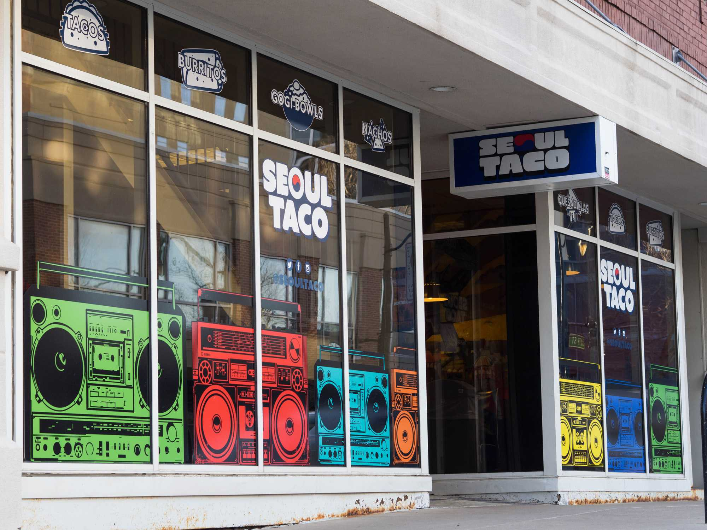
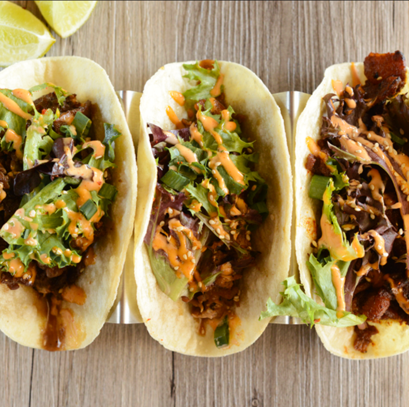
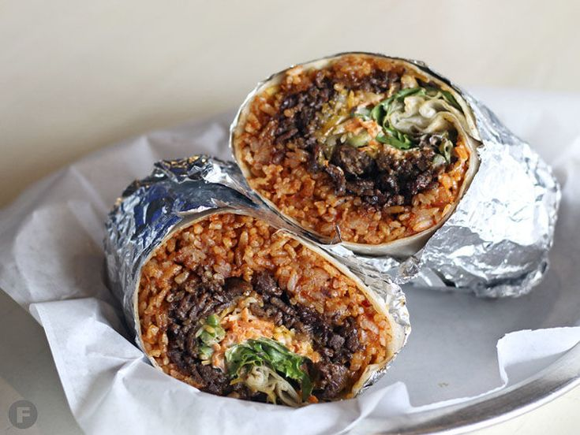

# SEOUL TACO MENU
6665 Delmar Blvd. Universiy City |
(314) 863-1148

## Entre
#### Taco - $2.50

*With Korean salad, green onion, Seoul sauce, crushed sesame seeds, and a wedge of lime*
#### Burrito - $8

*With kimchi fried rice, lettuce, cheese, carrots, green onions, sour cream, and Seoul sauce*

#### Gogi Bowl - $7

*With rice, fresh veggies, fried egg, carrots, green , sesame oil, and spicy Gochujang pepper sauce (fried rice +$1) (brown rice +$0.50)*
#### Quesadilla - $8
*With jack and cheddar cheese, lettuce, sour cream, and Seoul sauce*

|Choice of Protien|
| ------------- |
|Bulgogi Steak|
|Chicken|
|Spicy Pork|
|Tofu|

|Sides||
| ------------- |:-------------:|
|Kimchi Slaw|$2|
|OG Kimchi|$2|
|Chips and Queso|$4|
|Seaonal Soup|$5.75|

|Extras||
| ------------- |:-------------:|
|Double Meat|$4|
|Extra Meat|$2|
|Egg|$1|
|Sour Cream|$0.75|
|Cheese|$0.75|

|Drinks||
| ------------- |:-------------:|
|Bottled Water|$1.50|
|Fountain Soda|$2|
|Bottled Soda|$2.50|

For more information, catering information, or to let us know how were doing...
Follow us @SEOULTACO